# Sprites list
| Sprite | Icon |
|--------|------|
|100tb||
|500px||
|6px||
|admob||
|adroll||
|adyen||
|aerospike||
|airbnb||
|airbrake||
|airflow||
|airtable||
|akamai||
|akka||
|alfresco||
|algolia||
|altair||
|amazon-chime||
|amazon-connect||
|amex||
|ampersand||
|android-icon||
|android||
|angellist||
|angular-icon||
|angular||
|ansible||
|apache-camel||
|apache||
|apache_cloudstack||
|api-ai||
|apiary||
|apigee||
|apitools||
|apollostack||
|appbase||
|appcelerator||
|appcode|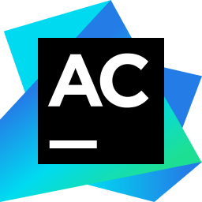|
|appdynamics||
|appfog||
|apphub||
|appium||
|apple-app-store||
|apple-pay||
|apple||
|appmaker||
|apportable||
|appsignal-icon||
|appsignal||
|apptentive||
|appveyor||
|arangodb||
|archlinux||
|arduino|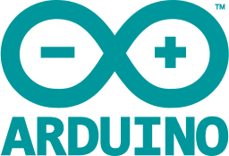|
|armory||
|asana||
|astronomer||
|atlassian||
|atom||
|atomic|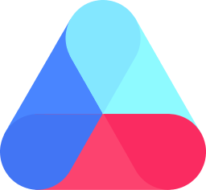|
|aurelia||
|aurora||
|aurous||
|auth0||
|authy||
|autocode||
|autoit||
|autoprefixer||
|ava||
|awesome||
|aws-api-gateway||
|aws-cloudformation||
|aws-cloudfront|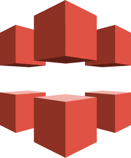|
|aws-cloudsearch||
|aws-cloudwatch||
|aws-codedeploy||
|aws-cognito||
|aws-dynamodb||
|aws-ec2||
|aws-elastic-cache|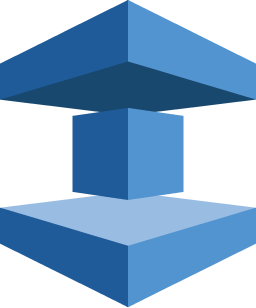|
|aws-glacier||
|aws-iam||
|aws-kinesis||
|aws-lambda||
|aws-mobilehub||
|aws-opsworks||
|aws-quicksight||
|aws-rds||
|aws-route53||
|aws-s3||
|aws-ses||
|aws-sns||
|aws-sqs|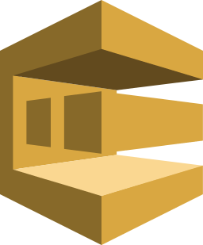|
|aws-waf||
|aws||
|azure||
|babel||
|backbone-icon||
|backbone||
|backerkit||
|baker-street||
|bamboo||
|basecamp||
|basekit||
|bash||
|batch||
|beats||
|behance||
|bem-2||
|bem||
|bigpanda||
|bing||
|bitballoon||
|bitbucket||
|bitcoin||
|bitnami||
|bitrise-icon||
|bitrise||
|blocs||
|blogger||
|blossom||
|bluemix|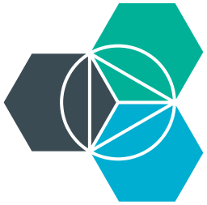|
|blueprint|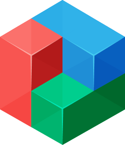|
|bluetooth||
|bootstrap||
|bosun||
|botanalytics||
|bourbon||
|bower||
|bowtie||
|box||
|brackets||
|branch||
|brandfolder-icon||
|brandfolder||
|brave||
|braze||
|broccoli||
|brotli||
|browserify-icon||
|browserify||
|browserling||
|browserslist||
|browserstack||
|browsersync||
|brunch||
|buck||
|buddy||
|buffer||
|bugherd||
|bugsee||
|bugsnag||
|bulma||
|c-plusplus||
|c-sharp||
|c||
|cachet||
|caffe2||
|cakephp||
|campaignmonitor-icon||
|campaignmonitor||
|campfire||
|canjs||
|capistrano||
|carbide||
|cassandra||
|celluloid|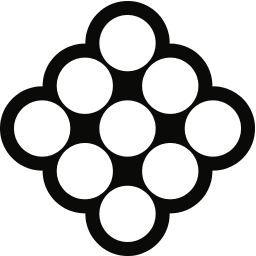|
|centos-icon||
|centos||
|certbot||
|chai||
|chalk||
|changetip||
|chargebee-icon||
|chargebee||
|chartblocks||
|chef||
|chevereto||
|chromatic-icon||
|chromatic||
|chrome||
|circleci||
|cirrus|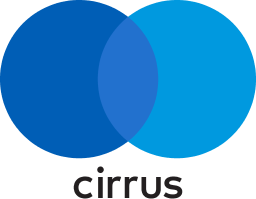|
|clickdeploy||
|clion||
|cljs||
|clojure||
|close||
|cloud9||
|cloudacademy||
|cloudant||
|cloudcraft||
|cloudera||
|cloudflare||
|cloudinary||
|cloudlinux||
|clusterhq||
|cobalt||
|cockpit||
|cocoapods||
|codacy||
|codebase||
|codebeat||
|codecademy||
|codeception||
|codeclimate||
|codecov||
|codefactor|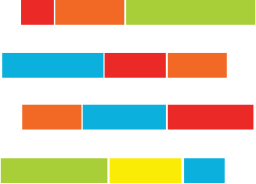|
|codefund-icon|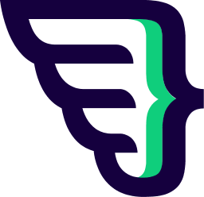|
|codefund||
|codeigniter||
|codepen-icon||
|codepen||
|codepicnic||
|codepush||
|coderwall||
|codesandbox||
|codeschool||
|codeship||
|codio||
|codrops||
|coffeescript||
|compass||
|component||
|componentkit||
|compose||
|composer||
|concourse||
|concrete5||
|confluence||
|consul||
|containership||
|contentful||
|convox||
|copyleft-pirate||
|copyleft||
|cordova|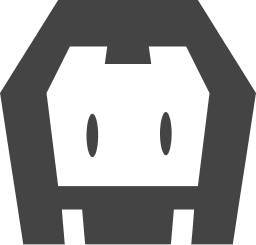|
|coreos-icon||
|coreos||
|couchbase||
|couchdb-icon||
|couchdb||
|coursera||
|coveralls||
|cpanel||
|craftcms||
|crashlytics||
|crateio||
|createjs||
|cross-browser-testing||
|crucible||
|crystal||
|css-3||
|css-3_official||
|cssnext||
|cucumber||
|customerio||
|cyclejs||
|cypress||
|d3||
|dapulse||
|dart||
|dashlane||
|dat||
|database-labs||
|dcos||
|debian||
|delicious||
|delighted||
|dependencyci||
|deploy||
|deppbot||
|derby||
|designernews||
|desk||
|deviantart||
|digital-ocean||
|dimer||
|dinersclub||
|discord||
|discover||
|disqus||
|django||
|dockbit||
|docker-icon||
|docker||
|doctrine||
|docusaurus||
|dojo-icon||
|dojo-toolkit||
|dojo||
|dotnet||
|doubleclick||
|dreamfactory||
|dreamhost||
|dribbble-icon||
|dribbble||
|drift||
|drip||
|drone||
|dropbox||
|dropmark||
|dropzone||
|drupal-icon||
|drupal||
|duckduckgo||
|dyndns||
|eager||
|ebanx||
|eclipse||
|egghead||
|elasticbox||
|elasticsearch||
|electron||
|element||
|elemental-ui||
|elementary||
|ello||
|elm||
|elo||
|emacs||
|embedly||
|ember-tomster||
|ember||
|emmet||
|engine-yard||
|envato||
|envoyer||
|enyo||
|erlang||
|es6|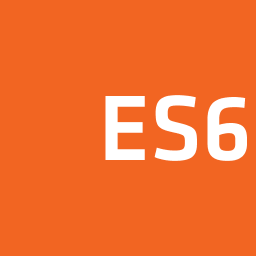|
|esdoc||
|eslint-old||
|eslint||
|eta-lang||
|etcd||
|ethereum||
|ethnio||
|eventbrite-icon||
|eventbrite||
|eventsentry||
|expo||
|exponent||
|express||
|fabric||
|fabric_io||
|facebook||
|falcor||
|fastlane||
|fastly||
|feathersjs||
|fedora||
|figma||
|firebase||
|firefox||
|flannel||
|flarum||
|flask||
|flat-ui||
|flattr||
|fleep||
|flexible-gs||
|flickr||
|flight||
|flocker||
|floodio||
|flow||
|flowxo||
|floydhub||
|flutter||
|flux||
|fluxxor|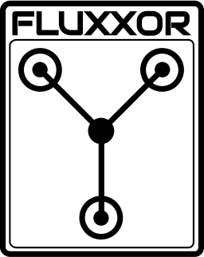|
|fly||
|flyjs||
|fomo||
|font-awesome||
|forest||
|forever||
|formkeep||
|foundation||
|framework7||
|freebsd||
|freedcamp-icon||
|freedcamp||
|freedomdefined||
|frontapp||
|fsharp||
|fuchsia||
|galliumos||
|game-analytics||
|gatsby||
|gaugeio||
|geekbot||
|get-satisfaction||
|ghost||
|giantswarm||
|git-icon|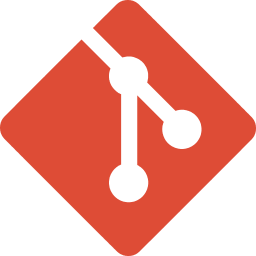|
|git||
|gitboard||
|github-icon||
|github-octocat||
|github||
|gitkraken||
|gitlab||
|gitter||
|gitup||
|glamorous||
|gleam||
|glimmerjs||
|glint||
|gnu||
|go||
|gocd||
|gomix|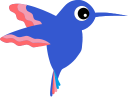|
|google-2014||
|google-360suite||
|google-ads||
|google-adsense||
|google-adwords||
|google-analytics||
|google-calendar||
|google-cloud-functions|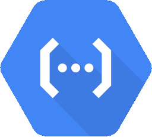|
|google-cloud-platform||
|google-cloud-run||
|google-cloud||
|google-data-studio||
|google-developers-icon||
|google-developers||
|google-drive||
|google-gmail||
|google-gsuite||
|google-icon||
|google-inbox||
|google-marketing-platform||
|google-meet||
|google-optimize||
|google-pay||
|google-photos||
|google-play-icon||
|google-play||
|google-plus||
|google-tag-manager||
|google-wallet||
|google||
|gopher||
|gordon||
|gradle||
|grafana||
|grails||
|grape|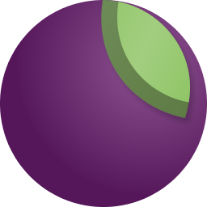|
|graphcool||
|graphene||
|graphql|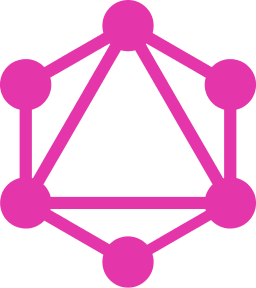|
|gratipay||
|grav||
|gravatar||
|graylog||
|gridsome-icon||
|gridsome||
|grommet||
|groovehq||
|grove||
|grunt||
|gulp|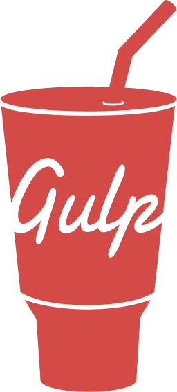|
|gunicorn||
|gusto||
|gwt||
|hack||
|hacker-one||
|hadoop||
|haiku|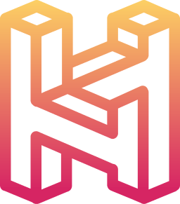|
|haml||
|hanami||
|handlebars||
|hapi||
|harrow||
|hashnode||
|haskell-icon||
|haskell||
|hasura||
|haxe||
|haxl||
|hbase||
|heap||
|helpscout||
|heroku-icon||
|heroku-redis||
|heroku||
|heron||
|hexo||
|hhvm||
|hibernate||
|highcharts||
|hipercard||
|hoa||
|hoodie||
|horizon||
|hosted-graphite||
|hostgator||
|houndci||
|html-5||
|html5-boilerplate||
|hubspot||
|hugo||
|humongous||
|hyper|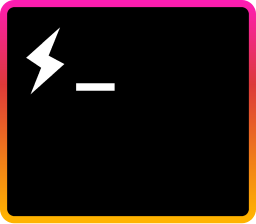|
|hyperapp||
|ibm||
|ieee||
|ifttt||
|imagemin||
|immutable||
|impala||
|importio||
|infer||
|inferno||
|influxdb||
|ink|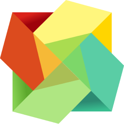|
|instagram-icon||
|instagram||
|intellij-idea||
|intercom||
|internetexplorer||
|invision||
|io|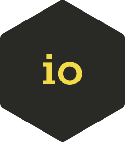|
|ionic|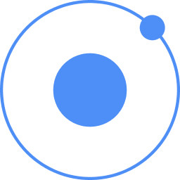|
|ios||
|iron-icon|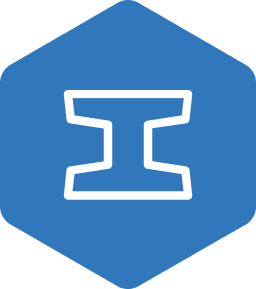|
|iron||
|itsalive||
|jade||
|jamstack||
|jasmine||
|java||
|javascript||
|jcb||
|jekyll||
|jelastic||
|jenkins||
|jest||
|jetbrains||
|jhipster||
|jira||
|joomla||
|jquery-mobile||
|jquery||
|jruby||
|jsbin||
|jsdelivr||
|jsdom||
|jsfiddle||
|json|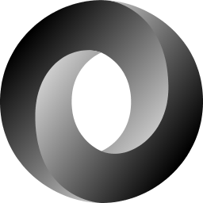|
|jspm|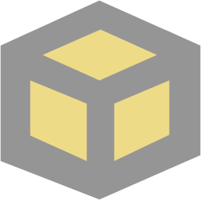|
|juju||
|julia||
|jupyter||
|kafka-icon||
|kafka||
|kaios||
|kallithea|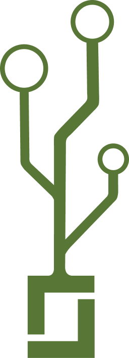|
|karma||
|keen||
|kemal||
|keycdn||
|keystonejs||
|khan_academy||
|kibana||
|kickstarter||
|kinto||
|kinvey||
|kirby||
|kissmetrics||
|kitematic||
|kloudless||
|knex||
|knockout||
|koa||
|kong||
|kontena||
|kops||
|kore||
|koreio||
|kotlin||
|kraken||
|krakenjs||
|kubernetes||
|kustomer||
|laravel|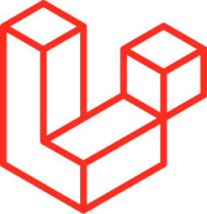|
|lastfm||
|lateral||
|launchkit||
|launchrock||
|leafjet||
|leankit-icon||
|leankit||
|less||
|letsencrypt||
|leveldb||
|librato||
|liftweb||
|lighttpd||
|linkedin||
|linkerd||
|linode||
|linux-mint||
|linux-tux||
|litmus||
|loader|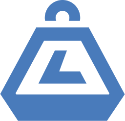|
|locent|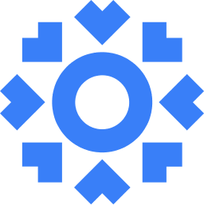|
|lodash||
|logentries||
|loggly||
|logmatic||
|logstash||
|lookback||
|looker||
|loopback-icon||
|loopback||
|losant||
|lua||
|lucene.net||
|lucene||
|lumen||
|lynda||
|macOS||
|maestro||
|mageia||
|magento||
|magneto||
|mailchimp-freddie||
|mailchimp||
|maildeveloper||
|mailgun-icon||
|mailgun||
|mandrill-shield||
|mandrill||
|manifoldjs||
|mantl||
|manuscript||
|mapbox||
|maps-me||
|mapzen||
|mariadb-icon||
|mariadb||
|marionette||
|markdown||
|marko||
|marvel||
|mastercard||
|material-ui||
|materializecss||
|mattermost||
|maxcdn||
|mdn||
|mdx||
|medium||
|memcached||
|memsql-icon||
|memsql||
|mention||
|mercurial||
|mern||
|mesos|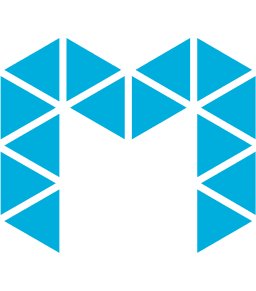|
|mesosphere||
|metabase|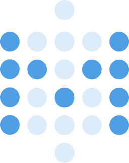|
|meteor-icon||
|meteor||
|microcosm||
|microsoft-edge||
|microsoft-windows||
|microsoft||
|middleman||
|milligram||
|mio||
|mist||
|mithril||
|mixmax|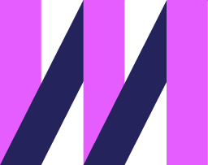|
|mixpanel||
|mlab||
|mobx||
|mocha||
|mockflow||
|modernizr||
|modx||
|moltin-icon||
|moltin||
|momentjs||
|monero||
|mongodb||
|mono||
|moon||
|mootools||
|morpheus||
|mozilla||
|mparticle||
|mysql||
|myth||
|namecheap||
|nanonets||
|nativescript||
|neat||
|neo4j||
|neonmetrics||
|neovim||
|nestjs||
|netbeans|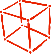|
|netflix-icon||
|netflix||
|netlify||
|netuitive||
|new-relic||
|nextjs||
|nginx||
|nightwatch||
|nodal||
|node-sass||
|nodebots||
|nodejitsu||
|nodejs-icon||
|nodejs||
|nodemon||
|nodeos||
|nodewebkit||
|nomad||
|now||
|noysi|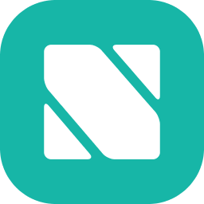|
|npm-2||
|npm||
|nuclide||
|nuodb||
|nuxt||
|oauth||
|ocaml||
|octodns||
|octopus-deploy||
|olapic||
|olark||
|onesignal||
|opbeat||
|open-graph||
|opencart||
|opencollective||
|opencv|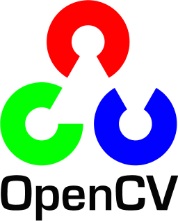|
|opengl||
|openlayers||
|openshift||
|opensource||
|openstack||
|opera||
|opsee||
|opsgenie||
|optimizely||
|oracle||
|oreilly||
|origami||
|origin||
|oshw|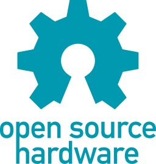|
|osquery|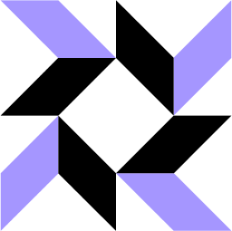|
|otto||
|packer||
|pagekit||
|pagekite||
|panda||
|parse||
|parsehub||
|passbolt||
|passport||
|patreon||
|paypal||
|peer5||
|pepperoni||
|percona||
|percy||
|perf-rocks||
|periscope||
|perl||
|phalcon||
|phoenix||
|phonegap-bot||
|phonegap||
|php||
|phpstorm||
|picasa||
|pingdom||
|pingy||
|pinterest||
|pipedrive||
|pipefy||
|pivotal_tracker||
|pixate||
|pkg||
|planless||
|plastic-scm||
|platformio||
|play||
|pm2||
|podio||
|poeditor||
|polymer||
|positionly||
|postcss||
|postgresql||
|postman||
|pouchdb||
|preact||
|precursor||
|prestashop||
|presto||
|prettier||
|prisma||
|processwire-icon||
|processwire||
|productboard||
|producthunt||
|progress||
|prometheus||
|promises||
|proofy||
|prospect||
|protactor||
|protoio||
|protonet||
|prott||
|pug||
|pumpkindb||
|puppet-icon||
|puppet||
|puppeteer|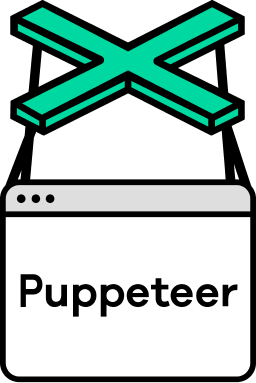|
|puppy-linux||
|pushbullet||
|pusher||
|pycharm||
|python|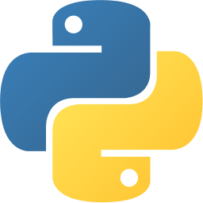|
|pytorch||
|pyup||
|q||
|qordoba||
|qt||
|quay||
|quobyte||
|quora||
|r-lang||
|rabbitmq||
|rackspace||
|rails||
|ramda||
|raml||
|rancher||
|raphael||
|raspberry-pi||
|rax||
|react-router||
|react-styleguidist||
|react||
|reactivex||
|realm||
|reapp||
|reasonml-icon||
|reasonml||
|recast.ai||
|reddit-icon||
|reddit||
|redhat||
|redis||
|redsmin||
|redspread||
|redux-observable||
|redux-saga||
|redux|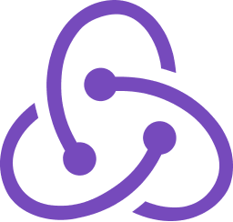|
|refactor||
|reindex||
|relay||
|remergr||
|require||
|rest-li||
|rest||
|rethinkdb||
|riak||
|riot||
|rkt||
|rocket-chat||
|rocksdb||
|rollbar||
|rollup||
|rollupjs||
|rsa||
|rsmq||
|rubocop||
|ruby||
|rubygems||
|rubymine||
|rum|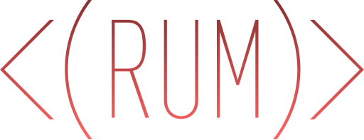|
|run-above||
|runnable||
|runscope||
|rust||
|rxdb||
|safari||
|sagui||
|sails||
|salesforce||
|saltstack||
|sameroom||
|sanity||
|sass-doc||
|sass||
|saucelabs||
|scala||
|scaledrone|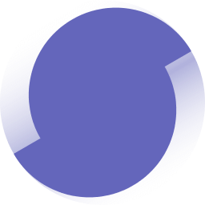|
|scaphold||
|scribd||
|sectionio||
|segment||
|selenium||
|semantic-ui||
|semantic-web||
|semaphore||
|sencha||
|sendgrid||
|seneca||
|sensu||
|sentry||
|sequelize|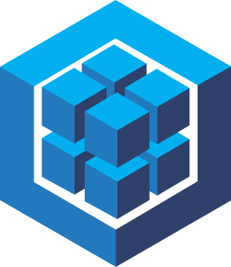|
|serveless||
|serverless||
|sherlock||
|shields||
|shipit||
|shippable||
|shogun||
|shopify||
|sidekick||
|sidekiq|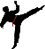|
|signal||
|sinatra||
|siphon||
|sitepoint||
|sketch||
|sketchapp||
|skylight||
|skype||
|slack-icon||
|slack||
|slides||
|slim||
|smartling||
|smashingmagazine||
|snap-svg||
|sninnaker|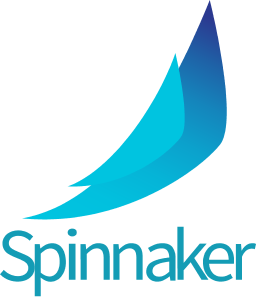|
|snupps||
|snyk||
|socket.io||
|solid||
|solr||
|sonarqube||
|soundcloud||
|sourcegraph||
|sourcetrail||
|sourcetree||
|spark||
|sparkcentral||
|sparkpost||
|speakerdeck||
|speedcurve||
|spinnaker||
|spree||
|spring||
|sqldep||
|sqlite||
|square||
|squarespace||
|stackoverflow-icon||
|stackoverflow||
|stackshare||
|stacksmith|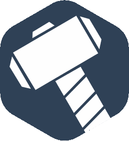|
|statuspage||
|steam||
|steroids||
|stetho||
|stickermule||
|stitch||
|stoplight||
|stormpath||
|storybook-icon||
|storybook||
|strapi||
|strider||
|stripe||
|struts||
|styleci||
|stylefmt||
|stylelint||
|stylus||
|subversion||
|sugarss||
|supergiant||
|supersonic||
|supportkit||
|surge||
|survicate||
|suse||
