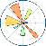
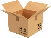
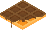

# Sprites list
| Sprite | Icon |
|--------|------|
|100tb||
|500px||
|6px||
|active-campaign||
|active-campaign-icon||
|admob||
|adobe-after-effects||
|adobe-animate||
|adobe-dreamweaver||
|adobe-illustrator||
|adobe-incopy||
|adobe-indesign||
|adobe-lightroom||
|adobe-photoshop||
|adobe-premiere||
|adobe-xd||
|adonisjs||
|adonisjs-icon||
|adroll||
|adyen||
|aerogear||
|aerospike||
|aerospike-icon||
|aha||
|airbnb||
|airbnb-icon||
|airbrake||
|airflow||
|airflow-icon||
|airtable||
|aix||
|akamai||
|akka||
|alfresco||
|algolia||
|alpinejs||
|alpinejs-icon||
|altair||
|amazon-chime||
|amazon-connect||
|amd||
|amex||
|amp||
|ampersand||
|amp-icon||
|amplication||
|amplication-icon||
|amplitude||
|amplitude-icon||
|android||
|android-icon||
|android-vertical||
|angellist||
|angular||
|angular-icon||
|ansible||
|ant-design||
|apache||
|apache-camel||
|apache_cloudstack||
|api-ai||
|apiary||
|apigee||
|apitools||
|apollostack||
|apostrophe||
|appbase||
|appbaseio||
|appbaseio-icon||
|appcelerator||
|appcenter||
|appcenter-icon||
|appcircle||
|appcircle-icon||
|appcode||
|appdynamics||
|appdynamics-icon||
|appfog||
|apphub||
|appium||
|apple||
|apple-app-store||
|apple-pay||
|appmaker||
|apportable||
|appsignal||
|appsignal-icon||
|apptentive||
|appveyor||
|appwrite||
|appwrite-icon||
|arangodb||
|arangodb-icon||
|architect||
|architect-icon||
|archlinux||
|arduino||
|argo||
|argo-icon||
|arm||
|armory||
|armory-icon||
|asana||
|asana-icon||
|asciidoctor||
|assembla||
|assembla-icon||
|astro||
|astronomer||
|atlassian||
|atom||
|atomic||
|atomic-icon||
|atomicojs||
|atomicojs-icon||
|atom-icon||
|aurelia||
|aurora||
|aurous||
|auth0||
|auth0-icon||
|authy||
|autocode||
|autoit||
|autoprefixer||
|ava||
|awesome||
|aws-amplify||
|aws-api-gateway||
|aws-appflow||
|aws-app-mesh||
|aws-appsync||
|aws-athena||
|aws-aurora||
|aws||
|aws-backup||
|aws-batch||
|aws-certificate-manager||
|aws-cloudformation||
|aws-cloudfront||
|aws-cloudsearch||
|aws-cloudtrail||
|aws-cloudwatch||
|aws-codebuild||
|aws-codecommit||
|aws-codedeploy||
|aws-codepipeline||
|aws-codestar||
|aws-cognito||
|aws-config||
|aws-documentdb||
|aws-dynamodb||
|aws-ec2||
|aws-ecs||
|aws-eks||
|aws-elasticache||
|aws-elastic-beanstalk||
|aws-elastic-cache||
|aws-elb||
|aws-eventbridge||
|aws-fargate||
|aws-glacier||
|aws-glue||
|aws-iam||
|aws-keyspaces||
|aws-kinesis||
|aws-kms||
|aws-lake-formation||
|aws-lambda||
|aws-lightsail||
|aws-mobilehub||
|aws-mq||
|aws-msk||
|aws-neptune||
|aws-open-search||
|aws-opsworks||
|aws-quicksight||
|aws-rds||
|aws-redshift||
|aws-route53||
|aws-s3||
|aws-secrets-manager||
|aws-ses||
|aws-shield||
|aws-sns||
|aws-sqs||
|aws-step-functions||
|aws-systems-manager||
|aws-timestream||
|aws-vpc||
|aws-waf||
|aws-xray||
|axios||
|azure||
|babel||
|backbone||
|backbone-icon||
|backerkit||
|baker-street||
|balena||
|bamboo||
|basecamp||
|basecamp-icon||
|basekit||
|bash||
|bash-icon||
|batch||
|beats||
|behance||
|bem-2||
|bem||
|bigpanda||
|bing||
|bitballoon||
|bitbar||
|bitbucket||
|bitcoin||
|bitnami||
|bitrise||
|bitrise-icon||
|blender||
|blitzjs||
|blitzjs-icon||
|blocs||
|blogger||
|blossom||
|bluemix||
|blueprint||
|bluetooth||
|booqable||
|booqable-icon||
|bootstrap||
|bosun||
|botanalytics||
|bourbon||
|bower||
|bowtie||
|box||
|brackets||
|brainjs||
|branch||
|branch-icon||
|brandfolder||
|brandfolder-icon||
|brave||
|braze||
|braze-icon||
|broadcom||
|broadcom-icon||
|broccoli||
|brotli||
|browserify||
|browserify-icon||
|browserling||
|browserslist||
|browserstack||
|browsersync||
|brunch||
|bubble||
|bubble-icon||
|buck||
|buddy||
|buffer||
|bugherd||
|bugherd-icon||
|bugsee||
|bugsnag||
|bugsnag-icon||
|builder-io||
|builder-io-icon||
|buildkite||
|buildkite-icon||
|bulma||
|bun||
|bunny-net||
|bunny-net-icon||
|cachet||
|caffe2||
|cakephp||
|cakephp-icon||
|calibre||
|calibre-icon||
|campaignmonitor||
|campaignmonitor-icon||
|campfire||
|canjs||
|capacitorjs||
|capacitorjs-icon||
|capistrano||
|carbide||
|cardano||
|cardano-icon||
|cassandra||
|c||
|celluloid||
|centos||
|centos-icon||
|certbot||
|ceylon||
|chai||
|chalk||
|changetip||
|chargebee||
|chargebee-icon||
|chartblocks||
|chef||
|chevereto||
|chromatic||
|chromatic-icon||
|chrome||
|chrome-web-store||
|cinder||
|circleci||
|cirrus-ci||
|cirrus||
|clickdeploy||
|clio-lang||
|clion||
|cljs||
|clojure||
|close||
|cloud9||
|cloudacademy||
|cloudacademy-icon||
|cloudant||
|cloudcraft||
|cloudera||
|cloudflare||
|cloudflare-workers||
|cloudflare-workers-icon||
|cloudinary||
|cloudinary-icon||
|cloudlinux||
|clusterhq||
|cobalt||
|cockpit||
|cocoapods||
|coda||
|codacy||
|coda-icon||
|codebase||
|codebeat||
|codecademy||
|codeception||
|codeclimate||
|codeclimate-icon||
|codecov||
|codecov-icon||
|codefactor||
|codefactor-icon||
|codefund||
|codefund-icon||
|codeigniter||
|codeigniter-icon||
|codepen||
|codepen-icon||
|codepicnic||
|codepush||
|codersrank||
|codersrank-icon||
|coderwall||
|codesandbox||
|codesandbox-icon||
|codeschool||
|codesee||
|codesee-icon||
|codeship||
|codio||
|codrops||
|coffeescript||
|commitizen||
|compass||
|component||
|componentkit||
|compose||
|compose-multiplatform||
|composer||
|conan-io||
|concourse||
|concrete5||
|concretecms||
|concretecms-icon||
|conda||
|confluence||
|consul||
|containership||
|contentful||
|convox||
|convox-icon||
|copyleft||
|copyleft-pirate||
|corda||
|cordova||
|coreos||
|coreos-icon||
|couchbase||
|couchdb||
|couchdb-icon||
|coursera||
|coveralls||
|cpanel||
|c-plusplus||
|craftcms||
|crashlytics||
|crateio||
|createjs||
|create-react-app||
|cross-browser-testing||
|crucible||
|crystal||
|c-sharp||
|css-3||
|css-3_official||
|cssnext||
|cucumber||
|curl||
|customerio||
|customerio-icon||
|cyclejs||
|cypress||
|cypress-icon||
|d3||
|dapulse||
|dart||
|dashlane||
|dashlane-icon||
|database-labs||
|datadog||
|datagrip||
|dataspell||
|dat||
|datocms||
|datocms-icon||
|dbt||
|dbt-icon||
|dcos||
|dcos-icon||
|debian||
|delicious||
|delighted||
|delighted-icon||
|deno||
|dependabot||
|dependencyci||
|deploy||
|deployhq||
|deployhq-icon||
|deppbot||
|derby||
|descript||
|descript-icon||
|designernews||
|desk||
|deviantart||
|deviantart-icon||
|dgraph||
|dgraph-icon||
|dialogflow||
|digital-ocean||
|dimer||
|dinersclub||
|discord||
|discord-icon||
|discourse||
|discourse-icon||
|discover||
|disqus||
|django||
|django-icon||
|dockbit||
|docker||
|docker-icon||
|doctrine||
|docusaurus||
|dojo||
|dojo-icon||
|dojo-toolkit||
|dotnet||
|doubleclick||
|dovetail||
|dovetail-icon||
|dreamfactory||
|dreamhost||
|dribbble||
|dribbble-icon||
|drift||
|drip||
|drizzle||
|drizzle-icon||
|drone||
|drone-icon||
|drools||
|drools-icon||
|dropbox||
|dropmark||
|dropzone||
|drupal||
|drupal-icon||
|duckduckgo||
|dynatrace||
|dynatrace-icon||
|dyndns||
|eager||
|ebanx||
|eclipse||
|eclipse-icon||
|ecma||
|editorconfig||
|egghead||
|elasticbox||
|elasticpath||
|elasticpath-icon||
|elasticsearch||
|electron||
|elemental-ui||
|elementary||
|element||
|eleventy||
|ello||
|elm-classic||
|elm||
|elo||
|emacs-classic||
|emacs||
|embedly||
|ember||
|ember-tomster||
|emmet||
|enact||
|engine-yard||
|engine-yard-icon||
|envato||
|envoy||
|envoyer||
|envoy-icon||
|enyo||
|epsagon||
|epsagon-icon||
|erlang||
|es6||
|esbuild||
|esdoc||
|eslint||
|eslint-old||
|eta||
|eta-icon||
|eta-lang||
|etcd||
|ethereum-color||
|ethereum||
|ethers||
|ethnio||
|eventbrite||
|eventbrite-icon||
|eventsentry||
|evergreen||
|evergreen-icon||
|expo||
|expo-icon||
|exponent||
|express||
|fabric||
|fabric_io||
|facebook||
|falcor||
|fastify||
|fastify-icon||
|fastlane||
|fastly||
|fauna||
|fauna-icon||
|feathersjs||
|fedora||
|fetch||
|ffmpeg||
|ffmpeg-icon||
|figma||
|firebase||
|firefox||
|flannel||
|flarum||
|flask||
|flattr||
|flattr-icon||
|flat-ui||
|fleep||
|flexible-gs||
|flickr||
|flickr-icon||
|flight||
|flocker||
|floodio||
|flow||
|flowxo||
|floydhub||
|flutter||
|flux||
|fluxxor||
|fly||
|fly-icon||
|flyjs||
|fogbugz||
|fogbugz-icon||
|fomo||
|fomo-icon||
|font-awesome||
|forestadmin||
|forestadmin-icon||
|forest||
|forever||
|formkeep||
|fortran||
|foundation||
|framer||
|framework7||
|framework7-icon||
|freebsd||
|freedcamp||
|freedcamp-icon||
|freedomdefined||
|fresh||
|frontapp||
|fsharp||
|fuchsia||
|galliumos||
|game-analytics||
|game-analytics-icon||
|ganache||
|ganache-icon||
|gatsby||
|gaugeio||
|geekbot||
|geetest||
|geetest-icon||
|get-satisfaction||
|getyourguide||
|ghost||
|giantswarm||
|gin||
|gitboard||
|git||
|github-actions||
|github-copilot||
|github||
|github-icon||
|github-octocat||
|git-icon||
|gitkraken||
|gitlab||
|gitter||
|gitup||
|glamorous||
|glamorous-icon||
|gleam||
|glimmerjs||
|glint||
|glitch||
|glitch-icon||
|gnome||
|gnome-icon||
|gnu||
|gnu-net||
|gnupg||
|gnupg-icon||
|gocd||
|godot||
|godot-icon||
|go||
|gohorse||
|goland||
|gomix||
|google-2014||
|google-360suite||
|google-admob||
|google-adsense||
|google-ads||
|google-adwords||
|google-analytics||
|google-calendar||
|google-cloud-functions||
|google-cloud||
|google-cloud-platform||
|google-cloud-run||
|google-currents||
|google-data-studio||
|google-developers||
|google-developers-icon||
|google-domains||
|google-domains-icon||
|google-drive||
|google-fit||
|google-gmail||
|google||
|google-gsuite||
|google-home||
|google-icon||
|google-inbox||
|google-keep||
|google-maps||
|google-marketing-platform||
|google-meet||
|google-one||
|google-optimize||
|google-pay||
|google-pay-icon||
|google-photos||
|google-play||
|google-play-icon||
|google-plus||
|google-search-console||
|google-tag-manager||
|google-wallet||
|gopher||
|gordon||
|gradle||
|grafana||
|grails||
|grammarly||
|grammarly-icon||
|grape||
|graphcool||
|graphene||
|graphql||
|gratipay||
|gravatar||
|gravatar-icon||
|grav||
|graylog||
|graylog-icon||
|greensock||
|greensock-icon||
|gridsome||
|gridsome-icon||
|grommet||
|groovehq||
|grove||
|growth-book||
|growth-book-icon||
|grpc||
|grunt||
|gulp||
|gunicorn||
|gunjs||
|gusto||
|gwt||
|hacker-one||
|hack||
|hadoop||
|haiku||
|haiku-icon||
|haml||
|hanami||
|handlebars||
|hapi||
|hardhat||
|hardhat-icon||
|harness||
|harness-icon||
|harrow||
|hashicorp||
|hashicorp-icon||
|hashnode||
|hashnode-icon||
|haskell||
|haskell-icon||
|hasura||
|hasura-icon||
|haxe||
|haxl||
|hbase||
|hcaptcha||
|hcaptcha-icon||
|headlessui||
|headlessui-icon||
|heap||
|heap-icon||
|helm||
|helpscout||
|helpscout-icon||
|hermes||
|heroku||
|heroku-icon||
|heroku-redis||
|heron||
|hexo||
|hhvm||
|hibernate||
|highcharts||
|hipercard||
|hoa||
|homebrew||
|hoodie||
|hookstate||
|hootsuite||
|hootsuite-icon||
|horizon||
|hosted-graphite||
|hostgator||
|hostgator-icon||
|hotjar||
|hotjar-icon||
|houndci||
|html5-boilerplate||
|html-5||
|httpie||
|httpie-icon||
|hubspot||
|huggy||
|hugo||
|humongous||
|hyperapp||
|hyper||
|ibm||
|ieee||
|ietf||
|ifttt||
|imagemin||
|imba-icon||
|imba||
|immer-icon||
|immer||
|immutable||
|impala||
|importio||
|infer||
|inferno||
|influxdb-icon||
|influxdb||
|ink||
|insomnia||
|instagram-icon||
|instagram||
|intel||
|intellij-idea||
|intercom-icon||
|intercom||
|internetexplorer||
|invision-icon||
|invision||
|io||
|ionic-icon||
|ionic||
|ios||
|iron-icon||
|iron||
|itsalive-icon||
|itsalive||
|jade||
|jamstack-icon||
|jamstack||
|jasmine||
|java||
|javascript||
|jcb||
|jekyll||
|jelastic-icon||
|jelastic||
|jenkins||
|jest||
|jetbrains-icon||
|jetbrains||
|jetbrains-space-icon||
|jetbrains-space||
|jfrog||
|jhipster-icon||
|jhipster||
|jira||
|joomla||
|jotai||
|jquery||
|jquery-mobile||
|jruby||
|jsbin||
|jsdelivr||
|jsdom||
|jsfiddle||
|json||
|jspm||
|jss||
|juju||
|julia||
|jupyter||
|jwt-icon||
|jwt||
|kafka-icon||
|kafka||
|kaios||
|kallithea||
|karma||
|kde||
|keen||
|kemal||
|keycdn-icon||
|keycdn||
|keystonejs||
|khan_academy-icon||
|khan_academy||
|kibana||
|kickstarter-icon||
|kickstarter||
|kinto-icon||
|kinto||
|kinvey||
|kirby-icon||
|kirby||
|kissmetrics||
|kitematic||
|kloudless||
|knex||
|knockout||
|koa||
|kong-icon||
|kong||
|kontena||
|kops||
|koreio||
|kore||
|kotlin-icon||
|kotlin||
|krakenjs||
|kraken||
|ktor-icon||
|ktor||
|kubernetes||
|kustomer||
|languagetool||
|laravel||
|lastfm||
|lateral-icon||
|lateral||
|launchdarkly-icon||
|launchdarkly||
|launchkit||
|launchrock||
|leafjet||
|leaflet||
|leankit-icon||
|leankit||
|lerna||
|less||
|lets-cloud||
|letsencrypt||
|leveldb||
|librato||
|liftweb||
|lighthouse||
|lightstep-icon||
|lightstep||
|lighttpd||
|linkedin-icon||
|linkedin||
|linkerd||
|linode||
|linux-mint||
|linux-tux||
|lit-icon||
|lit||
|litmus||
|loader||
|locent||
|lodash||
|logentries||
|loggly||
|logmatic||
|logstash||
|lookback||
|looker-icon||
|looker||
|loom-icon||
|loom||
|loopback-icon||
|loopback||
|losant||
|lua||
|lucene||
|lucene.net||
|lumen||
|lynda||
|macOS||
|madge||
|maestro||
|mageia||
|magento||
|magneto||
|mailchimp-freddie||
|mailchimp||
|maildeveloper||
|mailgun-icon||
|mailgun||
|mailjet-icon||
|mailjet||
|malinajs||
|mandrill||
|mandrill-shield||
|manifoldjs||
|manjaro||
|mantine-icon||
|mantine||
|mantl||
|manuscript||
|mapbox-icon||
|mapbox||
|maps-me||
|mapzen-icon||
|mapzen||
|mariadb-icon||
|mariadb||
|marionette||
|markdown||
|marko||
|marvel||
|mastercard||
|mastodon-icon||
|mastodon||
|materializecss||
|material-ui||
|matomo-icon||
|matomo||
|matplotlib-icon||
|matplotlib||
|mattermost-icon||
|mattermost||
|maven||
|maxcdn||
|mdn||
|mdx||
|medium-icon||
|medium||
|medusa-icon||
|medusa||
|memcached||
|memsql-icon||
|memsql||
|mention||
|mercurial||
|mern||
|mesos||
|mesosphere||
|messenger||
|metabase||
|metamask-icon||
|metamask||
|meteor-icon||
|meteor||
|microcosm||
|micro-icon||
|micro||
|micron-icon||
|micron||
|micro-python||
|microsoft-azure||
|microsoft-edge||
|microsoft-icon||
|microsoft||
|microsoft-onedrive||
|microsoft-power-bi||
|microsoft-teams||
|microsoft-windows||
|mida-icon||
|mida||
|middleman||
|milligram||
|mint-lang||
|mio||
|mist||
|mithril||
|mixmax||
|mixpanel||
|mlab||
|mobx||
|mocha||
|mockflow-icon||
|mockflow||
|modernizr||
|modx-icon||
|modx||
|moltin-icon||
|moltin||
|momentjs||
|monday-icon||
|monday||
|monero||
|mongodb-icon||
|mongodb||
|mono||
|moon||
|mootools||
|morpheus-icon||
|morpheus||
|mozilla||
|mparticle-icon||
|mparticle||
|mps-icon||
|mps||
|msw-icon||
|msw||
|multipass||
|mysql-icon||
|mysql||
|myth||
|naiveui||
|namecheap||
|nanonets||
|nasm||
|nativescript||
|nats-icon||
|nats||
|neat||
|neo4j||
|neonmetrics||
|neovim||
|nestjs||
|netbeans||
|netflix-icon||
|netflix||
|netlify||
|netuitive||
|neverinstall-icon||
|neverinstall||
|new-relic-icon||
|new-relic||
|nextjs-icon||
|nextjs||
|nginx||
|nhost-icon||
|nhost||
|nightwatch||
|nim-lang||
|nocodb||
|nodal||
|nodebots||
|nodejitsu||
|nodejs-icon||
|nodejs||
|nodemon||
|nodeos||
|node-sass||
|nodewebkit||
|nomad-icon||
|nomad||
|notion-icon||
|notion||
|now||
|noysi||
|npm-2||
|npm-icon||
|npm||
|nuclide||
|numpy||
|nuodb||
|nuxt-icon||
|nuxt||
|nvidia||
|nx||
|oauth||
|observablehq||
|ocaml||
|octodns||
|octopus-deploy||
|olapic||
|olark||
|onesignal||
|opbeat||
|openai-icon||
|openai||
|opencart||
|opencollective||
|opencv||
|openframeworks||
|opengl||
|open-graph||
|openjs-foundation-icon||
|openjs-foundation||
|openlayers||
|openshift||
|opensource||
|openstack-icon||
|openstack||
|opentelemetry-icon||
|opentelemetry||
|open-zeppelin-icon||
|open-zeppelin||
|opera||
|opsee||
|opsgenie||
|optimizely-icon||
|optimizely||
|oracle||
|oreilly||
|origami||
|origin||
|oshw||
|osquery||
|otto||
|overloop-icon||
|overloop||
|p5js||
|packer||
|pagekite||
|pagekit||
|pagerduty-icon||
|pagerduty||
|panda||
|parcel-icon||
|parcel||
|parsehub||
|parse||
|partytown-icon||
|partytown||
|passbolt-icon||
|passbolt||
|passport||
|patreon||
|payload||
|paypal||
|peer5||
|pepperoni||
|percona||
|percy-icon||
|percy||
|perf-rocks||
|periscope||
|perl||
|phalcon||
|phoenix||
|phonegap-bot||
|phonegap||
|php-alt||
|php||
|phpstorm||
|picasa||
|pingdom||
|pingy||
|pinterest||
|pipedrive||
|pipefy||
|pivotal_tracker||
|pixate||
|pixijs||
|pkg||
|planetscale||
|planless-icon||
|planless||
|plasmic||
|plastic-scm||
|platformio||
|play||
|playwright||
|pluralsight-icon||
|pluralsight||
|pm2-icon||
|pm2||
|pnpm||
|pocket-base||
|podio||
|poeditor||
|polymer||
|positionly||
|postcss||
|postgraphile||
|postgresql||
|postman-icon||
|postman||
|pouchdb||
|preact||
|precursor||
|prerender-icon||
|prerender||
|prestashop||
|presto||
|prettier||
|prisma||
|prismic-icon||
|prismic||
|processing||
|processwire-icon||
|processwire||
|productboard-icon||
|productboard||
|producthunt||
|progress||
|prometheus||
|promises||
|proofy||
|prospect||
|protactor||
|protoio||
|protonet||
|protractor||
|prott||
|pug||
|pumpkindb||
|puppeteer||
|puppet-icon||
|puppet||
|puppy-linux||
|purescript-icon||
|purescript||
|pushbullet||
|pusher-icon||
|pusher||
|pwa||
|pycharm||
|pypi||
|pyscript||
|python||
|pytorch-icon||
|pytorch||
|pyup||
|qlik||
|qordoba||
|q||
|qt||
|qualcomm||
|quarkus-icon||
|quarkus||
|quay||
|quobyte||
|quora||
|qwik||
|rabbitmq-icon||
|rabbitmq||
|rackspace-icon||
|rackspace||
|rails||
|ramda||
|raml||
|rancher-icon||
|rancher||
|raphael||
|raspberry-pi||
|rax||
|reactivex||
|react-query-icon||
|react-query||
|react||
|react-router||
|react-spring||
|react-styleguidist||
|realm||
|reapp||
|reasonml-icon||
|reasonml||
|recaptcha||
|recast.ai||
|recoil-icon||
|recoil||
|reddit-icon||
|reddit||
|redhat-icon||
|redhat||
|redis||
|redsmin||
|redspread||
|redux-observable||
|redux||
|redux-saga||
|redwoodjs||
|refactor||
|reindex||
|relay||
|release||
|remergr||
|remix-icon||
|remix||
|renovatebot||
|replit-icon||
|replit||
|require||
|rescript-icon||
|rescript||
|rest-li||
|rest||
|rethinkdb||
|retool-icon||
|retool||
|riak||
|rider||
|riot||
|rkt||
|r-lang||
|rocket-chat-icon||
|rocket-chat||
|rocksdb||
|rocky-linux-icon||
|rocky-linux||
|rollbar-icon||
|rollbar||
|rollupjs||
|rollup||
|rome-icon||
|rome||
|ros||
|rsa||
|rsmq||
|rubocop||
|rubygems||
|rubymine||
|ruby||
|rum||
|run-above||
|runnable||
|runscope||
|rust||
|rxdb||
|safari||
|sagui||
|sails||
|salesforce||
|saltstack||
|sameroom||
|samsung||
|sanity||
|sap||
|sass-doc||
|sass||
|saucelabs||
|scala||
|scaledrone||
|scaphold||
|scribd-icon||
|scribd||
|seaborn-icon||
|seaborn||
|section-icon||
|sectionio||
|section||
|segment-icon||
|segment||
|selenium||
|semantic-release||
|semantic-ui||
|semantic-web||
|semaphoreci||
|semaphore||
|sencha||
|sendgrid-icon||
|sendgrid||
|seneca||
|sensu-icon||
|sensu||
|sentry-icon||
|sentry||
|sequelize||
|serveless||
|serverless||
|sherlock-icon||
|sherlock||
|shields||
|shipit||
|shippable||
|shogun||
|shopify||
|sidekick||
|sidekiq-icon||
|sidekiq||
|signal||
|sinatra||
|singlestore-icon||
|singlestore||
|siphon||
|sitepoint||
|skaffolder||
|sketchapp||
|sketch||
|sk-hynix||
|skylight||
|skype||
|slack-icon||
|slack||
|slides||
|slim||
|smartling||
|smashingmagazine||
|snap-svg||
|sninnaker||
|snowflake-icon||
|snowflake||
|snowpack||
|snupps||
|snyk||
|socket.io||
|solarwinds||
|solidity||
|solidjs-icon||
|solidjs||
|solid||
|solr||
|sonarqube||
|soundcloud||
|sourcegraph||
|sourcetrail||
|sourcetree||
|sparkcentral||
|sparkpost||
|spark||
|speakerdeck||
|speedcurve||
|spidermonkey-icon||
|spidermonkey||
|spinnaker||
|splunk||
|spotify-icon||
|spotify||
|spree||
|spring-icon||
|spring||
|sqldep||
|sqlite||
|squarespace||
|square||
|stackbit-icon||
|stackbit||
|stackblitz-icon||
|stackblitz||
|stackoverflow-icon||
|stackoverflow||
|stackshare||
|stacksmith||
|stately-icon||
|stately||
|statuspage||
|stdlib-icon||
|stdlib||
|steam||
|stenciljs-icon||
|stenciljs||
|steroids||
|stetho||
|stickermule||
|stigg-icon||
|stigg||
|stimulus-icon||
|stimulus||
|stitch||
|stoplight||
|stormpath||
|storyblocks-icon||
|storyblocks||
|storyblok-icon||
|storyblok||
|storybook-icon||
|storybook||
|strapi-icon||
|strapi||
|streamlit||
|strider||
|stripe||
|struts||
|styleci||
|stylefmt||
|stylelint||
|stylis||
|stylus||
|sublimetext-icon||
|sublimetext||
|subversion||
|sugarss||
|supabase-icon||
|supabase||
|supergiant||
|supersonic||
|supportkit||
|surge||
|surrealdb-icon||
|surrealdb||
|survicate-icon||
|survicate||
|suse||
|susy||
|svelte-icon||
|svelte-kit||
|svelte||
|svgator||
|svg||
|swagger||
|swc||
|swift||
|swiftype||
|swr||
|symfony||
|sysdig-icon||
|sysdig||
|t3||
|tableau-icon||
|tableau||
|taiga||
|tailwindcss-icon||
|tailwindcss||
|tapcart-icon||
|tapcart||
|targetprocess||
|taskade-icon||
|taskade||
|tastejs||
|tauri||
|tealium||
|teamcity||
|teamgrid||
|teamwork-icon||
|teamwork||
|tectonic||
|telegram||
|tensorflow||
|terminal||
|terraform-icon||
|terraform||
|terser-icon||
|terser||
|testcafe||
|testing-library||
|testlodge||
|testmunk||
|thimble||
|threejs||
|thymeleaf-icon||
|thymeleaf||
|tidal-icon||
|tidal||
|tiktok-icon||
|tiktok||
|titon||
|tnw||
|todoist-icon||
|todoist||
|todomvc||
|tomcat||
|toml||
|tor||
|torus||
|traackr||
|trac||
|travis-ci-monochrome||
|travis-ci||
|treasuredata-icon||
|treasuredata||
|treehouse||
|trello||
|trpc||
|truffle-icon||
|truffle||
|tsmc||
|tsnode||
|tsuru||
|tsu||
|tumblr-icon||
|tumblr||
|tunein||
|tuple||
|turbopack-icon||
|turbopack||
|turborepo-icon||
|turborepo||
|turret||
|tutsplus||
|tutum||
|tux||
|twilio-icon||
|twilio||
|twitch||
|twitter||
|typeform-icon||
|typeform||
|typeorm||
|typescript-icon-round||
|typescript-icon||
|typescript||
|typo3-icon||
|typo3||
|ubuntu||
|udacity-icon||
|udacity||
|udemy-icon||
|udemy||
|uikit||
|umu||
|unbounce-icon||
|unbounce||
|undertow||
|unionpay||
|unitjs||
|unito-icon||
|unito||
|unity||
|unocss||
|unrealengine-icon||
|unrealengine||
|upcase||
|upstash-icon||
|upstash||
|upwork||
|user-testing-icon||
|user-testing||
|uservoice-icon||
|uservoice||
|uwsgi||
|v8-ignition||
|v8-turbofan||
|v8||
|vaadin||
|vaddy||
|vagrant-icon||
|vagrant||
|vault-icon||
|vault||
|vector-timber||
|vector||
|vercel-icon||
|vercel||
|verdaccio-icon||
|verdaccio||
|vernemq||
|victorops||
|vimeo-icon||
|vimeo||
|vim||
|vine||
|visaelectron||
|visa||
|visual-studio-code||
|visual-studio||
|visual_website_optimizer||
|vitejs||
|vitest||
|vivaldi-icon||
|vivaldi||
|vlang||
|void||
|vuetifyjs||
|vueuse||
|vue||
|vulkan||
|vultr-icon||
|vultr||
|vwo||
|w3c||
|waffle-icon||
|waffle||
|wagtail||
|wakatime||
|walkme||
|watchman||
|wayscript-icon||
|wayscript||
|wearos||
|weave||
|web3js||
|webassembly||
|webcomponents||
|web.dev-icon||
|web.dev||
|webdriverio||
|webflow||
|web-fundamentals||
|webhint-icon||
|webhint||
|webhooks||
|webix-icon||
|webix||
|webkit||
|webmin||
|webpack||
|webplatform||
|webrtc||
|websocket||
|webstorm||
|webtask||
|webtorrent||
|weebly||
|wercker||
|whalar-icon||
|whalar||
|whatsapp-icon||
|whatsapp-monochrome-icon||
|whatsapp||
|whatwg||
|wicket-icon||
|wicket||
|wifi||
|wildfly||
|windi-css||
|wiredtree||
|wire||
|wix||
|wmr||
|woocommerce-icon||
|woocommerce||
|woopra||
|wordpress-icon-alt||
|wordpress-icon||
|wordpress||
|workboard||
|workplace-icon||
|workplace||
|wpengine||
|wufoo||
|xamarin||
|xampp||
|xcart||
|xero||
|xplenty||
|xray-for-jira||
|x-ray-goggles||
|xstate||
|xtend||
|xwiki-icon||
|xwiki||
|yahoo||
|yaml||
|yammer||
|yandex-ru||
|yarn||
|ycombinator||
|yeoman||
|yii||
|youtrack||
|youtube-icon||
|youtube||
|zabbix||
|zapier-icon||
|zapier||
|zeit-icon||
|zeit||
|zendesk-icon||
|zendesk||
|zend-framework||
|zenhub-icon||
|zenhub||
|zeplin||
|zeroheight-icon||
|zeroheight||
|zest||
|zigbee||
|zig||
|zoho||
|zorin-os||
|zube||
|zulip-icon||
|zulip||
|zwave||
